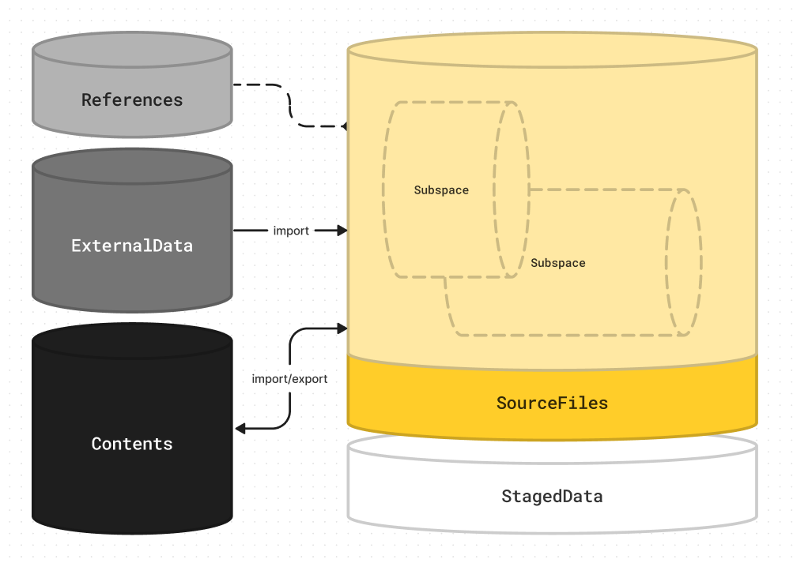

[中文文档](https://wcn96x0h20lt.feishu.cn/wiki/TAduwcqV3izhJ2kM3VpcZBW0n1d)

# Omoospace


Omoospace is a folder structure guideline for digital creation works. 

Its aim is universality, flexibility, and semantics not only for large projects and teamwork but also for small projects and solo work. Whether it is a 3d digital work or a animation production, it all fits.

If you are not sure how to design your project directory right, you can follow the [omoospace principles]([principles.md](https://omoolab.github.io/Omoospace/latest/why-omoospace))

## Usage

### Install uv

https://docs.astral.sh/uv/getting-started/installation/

### Omoospace CLI

Create an empty omoospace
```bash
uvx omoospace create <Name>
```

or make current folder as an omoospace
```bash
uvx omoospace init
```

more cli
```bash
uvx omoospace
```