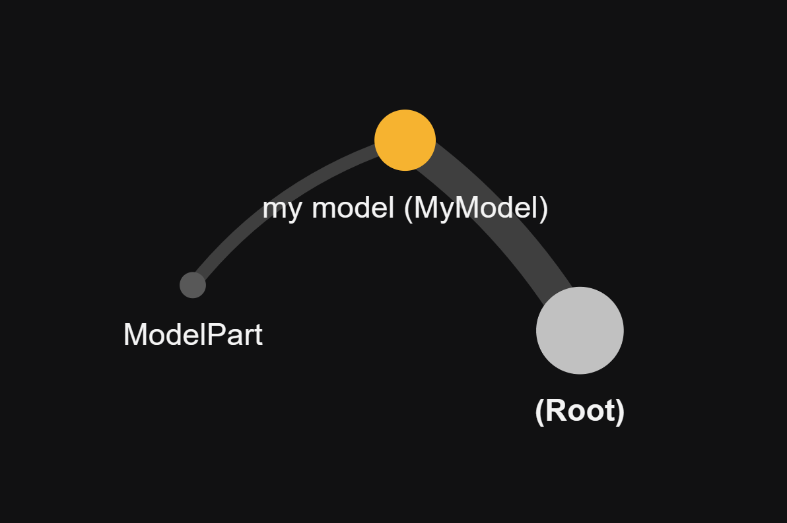

# Omoospace

Omoospace is a scalable directory structure solution for digital creation works. In order to follow omoospace rules easily, we provide CLI tools, including creating omoospace, shipping package, setting subspace, etc.

[What is "Omoospace", how does it rule all your creation files?](omoospace.md)

## Installation

Run the following command to install the dependencies:

```shell
pip install omoospace
```

Check if omoospace CLI tools is installed correctly.

```shell
omoospace --help
```

All commands are start with `omoospace`, however you can use alias `omoos`.

```shell
omoos --help
```

## Create New Omoospace

The CLIs we provide is not a necessary tool, but just an auxiliary tool for managing omoospace. Because omoospace is just a directory structure guide, and is simple enough to create manually. By using the ClIs you can avoid the repetitive work of creating directories and have more global view of the whole project structure which consist of nested subspaces.

First things first, let's create a new omoospace, run the following command:

```shell
omoos create
```

!!! note

    Normally the new omoospace will be created at shell working directory. If you want other direcotry, add command option `-d`. e.g. `omoos create -d path/to/destination/dir/`

Follow the setup wizard.

```shell
? Choose a template '*Empty'
? Choose the same again to confirm '*Empty'
? Enter Omoospace name 'my project'
? A brief of the Omoospace 'An omoospace for creation works'
? Confirm 'Yes'
Start create something! 🚀
```

The new created directory structure is simple:

```shell
MyProject # Omoospace root directory.
|-- Contents # Directory of all kinds of digital contents except sourece file.
|-- ExternalData # Directory of data from external sources.
|-- Omoospace.yml # Omoospace info, like its name, creators, works etc.
|-- References # Directory of reference files.
|-- SourceFiles # Directory of sourece files that saved working process.
`-- StagedData # Directory of intermediate data, temp files, etc.
```

!!! note

    Notes that the name "my project" is converted to PascalCase Style "MyProject".

If you want more complex subdirs, you can add subdirectories manually or choose other templates.

Now, you can start your creation works by saving source files to `SourceFiles/` 🎉

## Set Subspace Directory

For better organization of source files, we need to separate the main goal into several secondary goals by set subspaces. Just create a directory with `Subspace.yml` in itself under `SourceFiles/`. Or run the following command:

```shell
omoos set subspace
```

!!! tip

    You can use command option `-s` instead of sub-command `subspace`. e.g. `omoos set -s`

Follow the setup wizard.

```shell
Current working at 🛠️ my project
(C:\path\to\MyProject).
? Enter subspace parent directory 'C:\path\to\MyProject\SourceFiles'
? Enter subspace name 'my model'
? Enter a comment of this subspace (Optional) 'a game asset'
? Confirm 'Yes'
```

It creates subspace directory named "MyModel" as expected.

```shell
|-- SourceFiles
|   `-- MyModel
|       `-- Subspace.yml # The marker of subspace.
```

Now, you can save source files that relative to "MyModel" in it like below:

```shell
|-- SourceFiles
|   `-- MyModel
|       |-- ModelPart.blend # The complex part of model that prepared separately.
|       |-- MyModel.blend # The main file of "MyModel" for shading, riging, lookdev, etc.
|       |-- MyModel.spp # The source file of Substance 3D Painter.
|       |-- MyModel.zpr # The project file of Zbrush.
|       `-- Subspace.yml # The marker of subspace.
```

!!! note

    Notes that model textures are not saved here, but in Contents.

## Set Omoospace Profile

You can simply edit `Omoospace.yml` manually to edit omoospace profile. Or you can do it by using CLIs.

To set creator

```shell
omoos set creator
```

To set software

```shell
omoos set software
```

To set work

```shell
omoos set work
```

!!! tip

    Also you can use option instead of sub-command.
    `omoos set -c` equls `omoos set creator`
    `omoos set -so` equls `omoos set software`
    `omoos set -w` equls `omoos set work`

## Omoospace Summary Visualization

Another main feature of this CLI tools is overview of whole omoospace. We provide several graphs for better understanding the project structure. Run the following command:

```shell
omoos show
```

```shell
Current working at 🛠️ my project
(C:\path\to\MyProject).
╭───────────────────────────────── Summary ─────────────────────────────────╮
│                                                                           │
│   Name                                                                    │
│   my project (C:\path\to\MyProject)                                       │
│                                                                           │
│   Description                                                             │
│   An Omoospace for creation works                                         │
│                                                                           │
│   Creators                                                                │
│   ╭─────────────╮                                                         │
│   │ manan Owner │                                                         │
│   ╰─────────────╯                                                         │
│                                                                           │
│   Softwares                                                               │
│   ╭───────────────╮ ╭───────────────╮ ╭────────────────────────────╮      │
│   │ Blender 3.6.4 │ │ Zbrush 2023.2 │ │ Substance 3D Painter 9.0.0 │      │
│   ╰───────────────╯ ╰───────────────╯ ╰────────────────────────────╯      │
│                                                                           │
│   Works                                                                   │
│   ╭─────────────────────────────────┬─────────────────────────────────╮   │
│   │ Name                            │ Paths                           │   │
│   ├─────────────────────────────────┼─────────────────────────────────┤   │
│   │ MyModel                         │ MyModel                         │   │
│   ╰─────────────────────────────────┴─────────────────────────────────╯   │
│                                                                           │
│   Subspace Tree                                                           │
│   (Root)                       ╭──────────── instruction ─────────────╮   │
│   ╰── 📁 my model (MyModel)    │ 📁 --- direcotry subspace            │   │
│       ╰── 📄 ModelPart         │ which contains Subspace.yml.         │   │
│                                │                                      │   │
│                                │ 📄 --- file subspace                 │   │
│                                │ which refers to a leaf file.         │   │
│                                │                                      │   │
│                                │ 💿 --- phantom | unknown subspace    │   │
│                                │ which has no entity.                 │   │
│                                │                                      │   │
│                                │ ⛔ --- virtual subspace              │   │
│                                │ which have not created yet.          │   │
│                                ╰──────────────────────────────────────╯   │
│                                                                           │
│   Subspace Entities                                                       │
│   ╭───────────────────────────┬───────────────────┬───────────────────╮   │
│   │ Subspace                  │ Comments          │ Entities          │   │
│   ├───────────────────────────┼───────────────────┼───────────────────┤   │
│   │ 📁 my model (MyModel)     │ - a game asset    │ MyModel           │   │
│   │                           │                   │ MyModel.blend     │   │
│   │                           │                   │ MyModel.spp       │   │
│   │                           │                   │ MyModel.zpr       │   │
│   │ 📄 ModelPart              │                   │ ModelPart.blend   │   │
│   ╰───────────────────────────┴───────────────────┴───────────────────╯   │
│                                                                           │
│                                                                           │
╰───────────────────────────────────────────────────────────────────────────╯
```

You can set the structure graph HTML file path by option `-r` to visualize the subspace tree.

```shell
omoos show -r .
```


[subspace tree graph](assets/Structure.html)

## Switch between omoospaces

You may note that every time you run a command, it will always prompt out `current working omoospace`.

```shell
Current working at 🛠️ my project
(C:\path\to\MyProject).
```

It's necessary cos every command needs a target omoospace, but for convenient the CLI hide the referring setting behind. Here is the referring priority order of target omoospace.

1. command option `-os` is for referring the target omoospace root path. e.g. if your run `omoos set -s -os C:\Projects\MyProject`, then subspace will be added to `C:\Projects\MyProject`.
2. if `-os` is not set, then it will search from shell working directory to its root path until `Omoospace.yml` file is found.
3. if `Omoospace.yml` is not found, then it read the `working omoospace` in global setting. `working omoospace` is the target omoospace of last executed command.

Every time you run a command, it will do the 3 step to find the proper target. However, you still can change the `working omoospace` by yourself. Run the following command:

```shell
omoos to path/to/omoospace
```

If you leave the path empty, only `omoos to`, it will search from shell working directory. If it still not found, it will pop out a selection of recent target omoospaces for you.

```shell
No omoospace found in ".".
? Choose one from recent
❯ 'C:\path\to\MyProject'
  'C:\path\to\OtherProject'
```

## Export Package

Omoospace package is a data package for creative content sharing. To export a package, run the following command:

```sehll
omoos export
```

Finish the setup wizard.

```shell
Current working at 🛠️ my project
(C:\path\to\MyProject).
? Enter the item path or path pattern
'C:\path\to\MyProject\Contents\MyModel'
╭──────── Pending ─────────╮    ╭──── Checked ────╮
│                          │    │                 │
│    ? Contents\MyModel    │ => │                 │
│                          │    │                 │
╰──────────────────────────╯    ╰─────────────────╯
? Check if the items on left are wanted 'Yes'
╭──── Pending ────╮    ╭──────── Checked ─────────╮
│                 │    │                          │
│                 │ => │    √ Contents\MyModel    │
│                 │    │                          │
╰─────────────────╯    ╰──────────────────────────╯
? Name this package 'my asset'
? Enter a brief description of this package 'An omoospace package for sharing'
? Enter the verison of this package '0.1.0'
╭─────────────────────────── Export Package Form ───────────────────────────╮
│                                                                           │
│   Name                                                                    │
│   my asset                                                                │
│   (C:\path\to\MyProject\StagedData\Packages\MyAsset)                      │
│                                                                           │
│   Description                                                             │
│   An omoospace package for sharing                                        │
│                                                                           │
│   Version                                                                 │
│   0.1.0                                                                   │
│                                                                           │
│   Items                                                                   │
│   ╭─────────┬─────────────────────────────────────────────────────────╮   │
│   │ Name    │ Path                                                    │   │
│   ├─────────┼─────────────────────────────────────────────────────────┤   │
│   │ MyModel │ C:\path\to\MyProject\Contents\MyModel                   │   │
│   ╰─────────┴─────────────────────────────────────────────────────────╯   │
│                                                                           │
│                                                                           │
╰───────────────────────────────────────────────────────────────────────────╯
? Sure Yes
Processing... ━━━━━━━━━━━━━━━━━━━━━━━━━━━━━━━━━━━━━━━━ 100% 0:00:00
Successfully export! 📦
```

After that, a package directory will create in `StageData/Packages/` as default export path.

```shell
|-- StageData
|   `-- Packages
|       `-- MyAsset # The root directory of OmooCargo "MyAsset"
|           |-- Contents # Where contains the model file.
|           |-- README.md # Package's doc file.
|           `-- Package.yml # Package profile, like its name, creators, etc.
```

Now you can share the package directory any way you like, attaching to email, upload to cloud, publish to GitHub etc.

## Import Package

Importing is easy, run the following command at omoospace root directory:

```shell
omoos import ~/Downloads/MyAsset.zip
```

After that, a package directory will create in `ExternalData/`

```shell
|-- ExternalData
|   `-- MyAsset
|       |-- Contents
|       |-- README.md
|       `-- Package.yml
```
