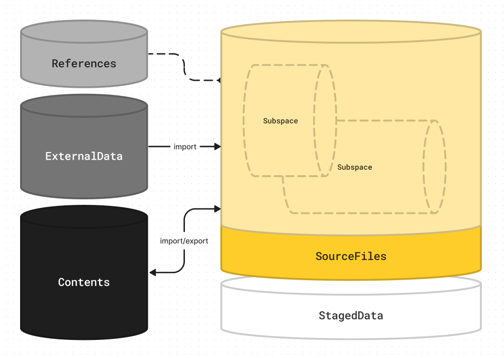

# Omoospace



Omoospace 是构建创意工作文件夹结构的心法。它的目标是，通用性、灵活性和语义性。不仅适用于复杂项目和团队合作，也适用于简单项目和个人工作。 [Why Omoospace?](why.md)

## 快速开始

### 新建项目

1. 新建文件夹作为项目根目录
2. 根目录下新建文件`OMOOSPACE.md`
3. 根目录下新建文件夹`contents/`，把资源型文件放进去
4. （可选）根目录下新建`subspaces/`，把制作型文件放进去
5. （可选）其他文件夹按需求设置，并放置对应类型的文件

### 已有项目

1. 根目录下新建文件`OMOOSPACE.md`
2. 编辑`OMOOSPACE.md`  
   添加`contents_dir: <资源型文件夹名>`  
   例如`contents_dir: Assets`（Unity）
     
3. （可选）编辑`subspaces_dir: ProjectFiles`  
   添加`subspaces_dir: <制作型文件夹名>`  
   例如`subspaces_dir: ProjectFiles`
     

## 开箱即用的小工具

### 安装 uv 和小工具

https://docs.astral.sh/uv/getting-started/installation/

```Bash
uv tool install omoospace[cli]
```

### 新建项目

```Bash
omoos create <Name>
```

### 已有项目

```Bash
cd <project folder>
omoos init
```
