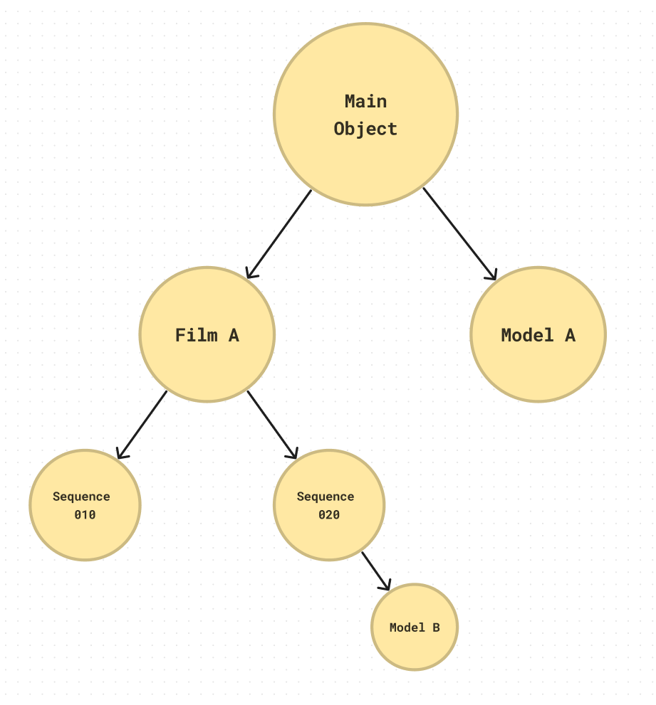
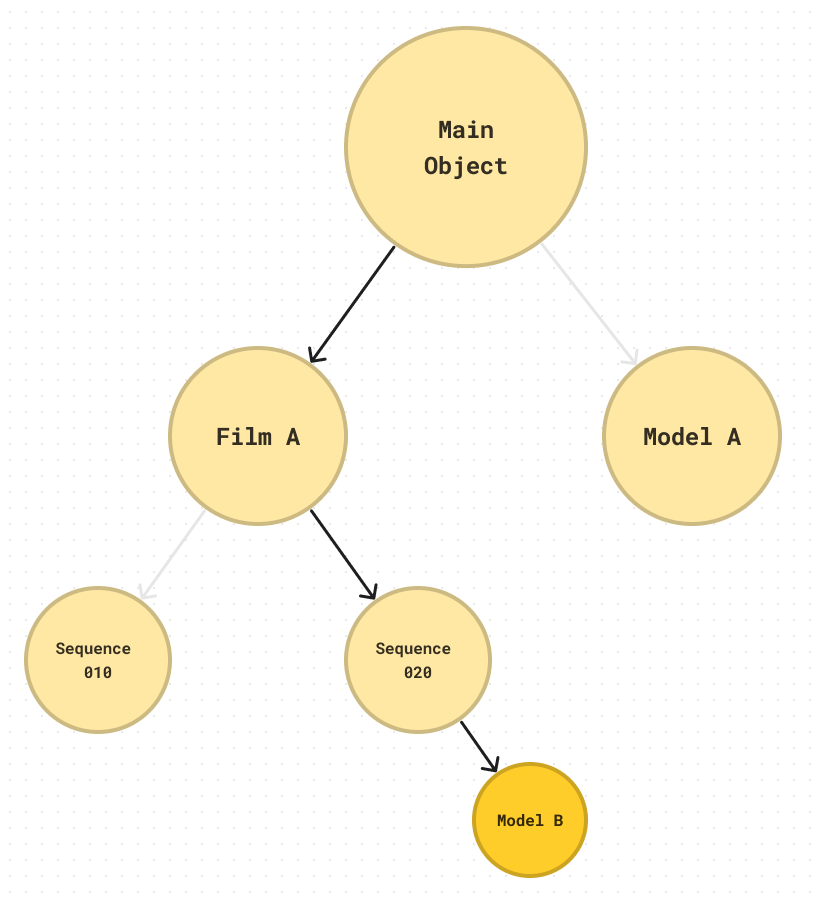

# What is omoospace?

Omoospace is a scalable directory structure solution for digital creation works. Its aim is universality, flexibility, and semantics not only for large projects and teamwork but also for small projects and solo work. Whether it is a 3d modeling task or a series production, it all fits.

## Overview

The rules are simple:

1. Naming everything with **PascalCase**.
2. 5 main directories:

    - `SourceFiles` stores source files of the software.
    - `Contents` stores digital content in a common format.
    - `ExternalData` stores data from external sources.
    - `References` stores reference resources (optional).
    - `StagedData` stores temporary data (optional).

3. `SourceFiles` `Contents` subdirectories (optional):

    - Process names set the `SourceFiles` subdirectories.
    - Content types set the `Contents` subdirectories.

4. Name source files and directory after their creation object as **Subspace**.
5. **Omoospace.yml** stores the workspace profile, such as creator profiles, software versions, etc.


A diagram illustrating the structure of omoospace

## Omoospace Structure

### Subspace

**Subspace** is a sub-workspace based on objects of creation conducive to finding, sorting, and understanding. Subspace can be nested. For example, an anime series project, each episode is a creation object. Under that object, multiple secondary objects can be set based on the episode’s sequences, and you can continue to split each secondary object. Each object is a sub-workspace of the main workspace. We call those sub-workspaces **Subspace**, and name them after their objects.

The nested subspaces can generate a tree-like graph that presents the structure of the entire project, as shown in the figure below.



#### Name source files and directory after their creation object as subspace.

```bash
|-- SourceFiles
|   `-- ModelB.blend
```

The filename hints that it is for creating `Model B`. But what if `Model B` is only a secondary object of `Sequence 010`?



Just use `_` to separate multi-level subspaces in the filename:

```bash
|-- SourceFiles
|   `-- FilmA_SQ020_ModelB.blend
```

The purpose can be told by its filename that it is for creating `Model B` of `Sequence 010` of `Film A`.

You can also create a **Subspace Directory** to avoid long filename prefixes. A subspace directory must contain a marker file named `Subspace.yml` to distinguish it from an ordinary directory.

```bash
|-- SourceFiles
|   `-- FilmA
|       |-- Subspace.yml # marker
|       `-- SQ020
|           |-- Subspace.yml # marker
|           `-- ModelB.blend
```

We call those source files and subspace directories **Entities** of their subspace. As you can imagine, one subspace may have multiple entities to present them.

```bash
|-- SourceFiles
|   `-- FilmA
|       |-- Subspace.yml # marker
|       |-- FilmA.prproj
|       |-- SQ020.prproj
|       `-- SQ020.blend
```

`SQ020.prproj` and `SQ020.blend` are `Sequence 010 (SQ020)` entities. Similarly, the directory `FilmA` and file `FilmA.prproj` are `Film A (FilmA)` entities. According to subspace entities, we classify subspaces into three kinds:

-   **Directory Subspace** has a directory to present it.
-   **File Subspace** has only files to present it, no directory.
-   **Phantom Subspace** has no direct content in its files.

!!! note

    The file `FilmA_SQ020_ModelB.blend` only contains the `Model B` object. `FilmA` and `SQ020` are just pure concepts. They are typical phantom subspaces.

#### A subspace route is formed by combining the subspace names from root to leaf.

The multi-level subspaces in `FilmA_SQ020_ModelB.blend` form a route from root to leaf: `FilmA > SQ020 > ModelB`. We call it **Subspace Route**.

Suppose the entity subspace nodes contain its parent subspace nodes. They should overlap each other as much as possible, for example:

```bash
# No overlap
|-- SourceFiles
|   |-- FilmA # FilmA
|   |   |-- Subspace.yml
|   |   `-- SQ020_ModelB.blend # SQ020 > ModelB
```

```bash
# `FilmA` is overlapped
|-- SourceFiles
|   |-- FilmA # FilmA
|   |   |-- Subspace.yml
|   |   `-- FilmA_SQ020_ModelB.blend # FilmA > SQ020 > ModelB
```

```bash
# `FilmA`, `SQ020` are overlapped
|-- SourceFiles
|   |-- FilmA_SQ020 # FilmA > SQ020
|   |   |-- Subspace.yml
|   |   `-- FilmA_SQ020_ModelB.blend # FilmA > SQ020 > ModelB
```

All examples' routes are all `FilmA > SQ020 > ModelB`.

!!! note

    There are no strict rules of when to use overlapping forms of directory structure. It is all up to the user's decision. Creators should design the directory structure to fit the project needs.

#### A subspace name should not be pure numbers or versions or autosave.

Numbers, versions, and autosave semantics are not for new objects, so they should not be subspace names. For example, `v001` in `FilmA_SQ020_ModelB_v001.blend`, is not a new creation object. The file is still for creating `ModelB`. The subspace definition defines a subspace as a particular creation object. So `v001` is not a subspace.

#### Write the subspace profile into Subspace.yml.

Besides a marker file, `Subspace.yml` is also a subspace profile.

```yaml
# Subspace.yml
name: Subspace's name
description: Comments to this subspace.
```

You can create the profile file to any subspace with the route as its filename, not the entire route but the subroute to the parent subspace.

```bash
|-- SourceFiles
|   |-- FilmA
|   |   |-- Subspace.yml
|   |   |-- SQ020.yml
|   |   |-- SQ020_ModelB.yml
|   |   `-- SQ020_ModelB.blend
```

```yaml
# SQ020.yml
name: Sequence 020
description: The beginning scene of the story.

# SQ020_ModelB.yml
name: Model B
description: A 3d model.
```

### SourceFiles

It stores the source files of the software or executable scripts, pipelines, etc.

`SourceFiles` stores processes, and `Contents` stores results. The former must be opened with specific software, executed by the program, and pre-computed. The latter generally allows cross-software reading without any pre-computation.

For example, I am using Blender's geometry node for procedural modeling. I should place the source file of Blender in `SourceFiles`. However, to load the procedural model in Unity, it is necessary to export it as a general format, such as .fbx, and I should place the exported file in `Contents`.

#### Subdirectories by process name (optional)

When a project grows, you may need to separate many source files into directories. Besides the subspace directory, we recommend setting subdirectories by process name.

Some optional process names:

```bash
# Film production processes
|-- SourceFiles
|   |-- PreProduction
|   |-- Production
|   `-- PostProduction
```

```bash
# Post-production subprocesses
|-- SourceFiles
|   |-- Compositing
|   |-- SoundEditing
|   `-- VideoEditing
```

You can add sequence numbers in front.

```bash
# 3D modeling processes
|-- SourceFiles
|   |-- 001-Modeling
|   |-- 002-Texturing
|   |-- 003-Rendering
|   `-- 004-Shading
```

You can mix use process directories and subspace directories.

```bash
<SeriesTitle> # (Root)
|-- SourceFiles
|   |-- PreProduction
|   |   `-- <ModelName> # (Root) > <ModelName>
|   `-- <Episode> # (Root) > <Episode>
|       |-- Subspace.yml
|       |-- Production
|       `-- PostProduction
```

Process subdirectories should fit your workflow. But be aware of the following rules:

-   Pay attention to the naming style. It should be a gerund for the process. For example, not "Models" but **"Modeling"**, not "Scenes" but **"SceneAssembling"**. This way, the **Process** is emphasized, not the result.
-   You can adjust the process subdirectories freely as the project expands.

#### Put source files without creation object under Void (optional)

Most source files have their object, such as rendering images or exporting a 3D model. However, some source files are not used as the primary process and have no particular object but have storage needs. We put such source files in a unique subspace called **Void**, which doesn’t need `Subspace.yml`.

!!! note

    Any subspaces in **Void** are also **Void Subspace**.

Void subspace can be in a filename prefix or as a directory.

```bash
|-- SourceFiles
|   |-- BeatingHeart
|   |   `-- Void_HowToBeat.hip
|   |-- Void_RnD_MetaBall.blend
|   |-- Void
|   |   `-- MaNan.hip
```

!!! note

    Although the source files under void subspace have no creation objects, they still allow outputting. However, their outputs could be more rigorous and necessary but experimental and temporary. For example, `Void/HeartBeating.blend` can still render `Void_HeartBeating.0001.png`. The prefix `Void` indicates the results are experimental.

#### SourceFiles structure is always dynamic when a project is in progress.

No one knows precisely what to do and how to do their creation work before starting. Plans never keep up with flashing of inspiration. Creation objects constantly change in progress. Although we make a rule for `SourceFiles` subdirectories, it's for semantic structure and does not mean subdirectories should be static.

**Feel free to organize files in `SourceFiles` and follow the inspiration during creation!**

### Contents

It stores digital content in a common format, whether internal or external, whether a work result or a resource. You should organize all content files here and stick to the rules.

#### Subdirectories by content type (optional)

Some optional content types:

```bash
# For modeling propose
|-- Contents
|   |-- Images
|   |-- Materials
|   |-- Models
|   `-- Renders
```

```bash
# For short video production propose
|-- Contents
|   |-- Audios
|   |-- Dynamics
|   |-- Images
|   |-- Materials
|   |-- Models
|   |-- Renders
|   `-- Videos
```

```bash
# For film production propose
|-- Contents
|   |-- Audios
|   |-- Dynamics
|   |-- Fonts
|   |-- HDAs # Houdini Digital Assets
|   |-- Images
|   |-- Materials
|   |-- Models
|   |   |-- Characters
|   |   |-- Nature
|   |   |-- Props
|   |   `-- ...
|   |-- Presets
|   |-- Renders
|   |-- Scenes
|   |-- ScientificData
|   |-- Scripts
|   |-- Settings
|   |-- Shaders
|   `-- Videos
```

Type subdirectories should fit your workflow. But be aware of the following rules:

-   Pay attention to the naming style. It should be the plural of the content type noun.
-   To avoid confusion and misplacement, merge similar content types into one.
-   It is not recommended to set multi-level subdirectories or add more subdirectories by content type as the project expands.

#### The output of the source file is named after its source file subspace route.

There is no subspace directory setting in `Contents`. But use subspace route as filename prefix to hint the relationship to its source file.

```bash
|-- Contents
|   `-- Models
|       |-- BloodCells_RBC.fbx
|       `-- BloodCells_WBC.fbx
|-- SourceFiles
|   `-- BloodCells.blend
```

In the above example, `BloodCells_RBC.fbx` and `BloodCells_WBC.fbx` come from `BloodCells.blend`. `RBC`, and `WBC` are subsets of `BloodCells.blend`. You can easily guess the relationship between them by their filenames.

In some cases, one content is a collection of multiple files. e.g., a 3d model with textures or an image sequence of render output. Those sub-file names do not necessarily contain route names, as they are with their root directory, which already hints at its source. As the example below, the texture filename does not need to have `Organs`, because you wouldn't use those textures without the mesh.

```bash
|-- Contents
|   `-- Models
|       `-- Organs_Heart
|           |-- Organs_Heart.fbx
|           `-- Textures
|               |-- Heart_Roughness.png
|               `-- Heart_BaseColor.png
|-- SourceFiles
|   `-- Organs.blend
```

**However, it does not mean using the entire route name is forbidden for sub-files, or you can name them randomly. Their name must be semantic.**

#### Keep the Contents structure flat and static as much as possible.

In most software, it will lose the link when the imported file changes its name, or someone moves it. The content files, always as IO paths for source files, must be stable. So, `Contents` should be centralized, and its structure should be flat and static, which means you should not move content files frequently or make super complex multi-level subdirectories changes often.

**Plan the structure at the beginning.**

### ExternalData

It stores all data files from external sources. The “external” here means that it is created by the creator outside omoospace or not produced within this omoospace. The most common usage of `ExternalData` is to store resources from the network.

#### No need to follow the naming rules; do not set any subdirectories by content type

Just keep its original file structure and naming style. For example:

```bash
|-- ExternalData
|   |-- www.models.com_CT_Scanner
|   |   |-- CT_Scanner.fbx
|   |   `-- tex
|   |-- textures_pack-4k
|   |   |-- wood
|   |   `-- metal
|   |-- MyResources
|   |   |-- Textures
|   |   |-- Materials
|   |   `-- Models
```

!!! note

    Do not put files in the root directory of `ExternalData`; always under the subdirectory.

#### It is not the only repository for all external data

`Contents` and `SourceFiles` also store external data. However, compared with `ExternalData`, they are stricter. All files need to be categorized and renamed correctly. Meanwhile, `ExternalData` is a storage place that allows users to ship data freely.

If you have stored external source data in `Contents` | `SourceFiles`, it is unnecessary to hold it in `ExternalData` again. For example, an HDRI downloaded from PolyHaven could be directly put under `Contents` if you rename it to PascalCase style.

!!! note

    Categorizing and renaming are not fun works, so storing external source data directly into `ExternalData` is recommended unless you can ensure files under `Contents` | `SourceFiles` are strict to the rules.

#### Access to own resource library contents by creating soft links in it.

You may have your resource library of 3D assets in a local or network directory (NAS). You usually don't know which asset suits the 3D scene most until you try, like HDRI. Repeating to move resource files from the library to the current working directory for trial isn't enjoyable.

So we prefer to create a soft link to the library in `ExternalData`, then you can easily access the assets from the library.

```bash
|-- ExternalData
|   `-- Resouces # Soft link
```

```bash
D:
|-- Resouces # My super 3D resource library for everything
|   |-- Models
|   |   |-- Cars
|   |   |-- Animals
|   |   |-- Plants
...
```

#### It stores omoospace packages

The omoospace package is designed for sharing omoospace data. You store them in `ExternalData`.

```bash
|-- ExternalData
|   |-- BloodCells # Package
|   |   |-- Package.yml # Package info
|   |   |-- Contents
|   |   |   `-- Models
|   |   |       `-- RedBooldCells_RBC.fbx
|   |   `-- SourceFiles
|   |       `-- RedBooldCells.blend
```

### References

It stores PureRef, Figma, Paper PDF, and Storyboard. Although you are not using them directly, you need to save them. Put them here.

!!! tip

    If it is Figma online, put the link as a file.

### StagedData

It stores any software-generated data that the source file can rebuild after deletion, such as temporary files, caches, software bridging files, etc. There is no need to browse `StagedData` unless necessary.

There are no rules for its subdirectory structure.

### Omoospace.yml

It stores workspace profiles such as creator profiles, software versions, etc.

<!-- prettier-ignore -->
```yaml
name: Omoospace's name
description: A brief of this Omoospace (Optional)
creators: # Creator list of this Omoospace
  - name: Creator's name
    email: Creator's email (Optional)
    role: Creator's role in this Omoospace (Optional)
    website: Creator's website (Optional)
softwares: # Software list of this Omoospace
  - name: Software's name
    version: Software's version
    plugins: # Plugins list of this Omoospace (Optional)
      - name: Plugin's name
        version: Plugin's version
works: # Work list of this Omoospace
  - name: Work's name
    itmes: 
      - Work's path under Contents
```

For example:

<!-- prettier-ignore -->
```yaml
name: my project
description: An omoospace for creation works
creators:
  - name: MaNan
    email: icrdr@abc.com
    website:
    role: Owner
softwares:
  - name: Blender
    version: 3.6.4
    plugins:
  - name: Zbrush
    version: 2023.2
    plugins:
  - name: Substance 3D Painter
    version: 9.0.0
    plugins:
works:
  - name: MyModel
    itmes:
      - MyModel
```

## Omoospace Package

Inspired by the Unity Package, the omoospace package is designed for sharing omoospace data.

ExternalData acts like a Packages directory of the Unity project that stores data from other omoospaces.

[Unity - Manual: Reusing Assets between Projects](https://docs.unity3d.com/2020.1/Documentation/Manual/HOWTO-exportpackage.html)

The internal structure of the package is part of its source omoospace

```bash
<PackageName>
|-- Contents # (Optional)
|-- ExternalData # (Optional)
|-- References # (Optional)
|-- SourceFiles # (Optional)
|-- StagedData # (Optional)
|-- README.md
`-- Package.yml # Package info
```

<!-- prettier-ignore -->
```yaml
# Package.yml
name: Package's name
version: Package's version
description: A brief of this Package (Optional)
creators: # Creator list of this package
  - name: Creator's name
    email: Creator's email (Optional)
    role: Creator's role in this Omoospace (Optional)
    website: Creator's website (Optional)
```

!!! note

    Once you export a package, it has nothing to do with its source omoospace

## Comparison with other software project structures

There are some common concepts to help understand.

| Omoospace     | Unity          | Unreal Engine                         |
| ------------- | -------------- | ------------------------------------- |
| Contents      | Assets         | Content                               |
| ExternalData  | Packages       |                                       |
| References    |                |                                       |
| SourceFiles   | Assets         | Source, Content                       |
| StagedData    | Temp           | Intermediate, Saved, DerivedDataCache |
| Omoospace.yml | PorjectSetting | Config                                |

## Q&A

-   **Q: Most directory structure solutions of CG work have no distinction between `Contents` and `SourceFiles`. Why does omoospace emphasize their differences ?**

    A: This is due to their different purposes of them. The content files, always as an IO path, need stability. So, `Contents` should be centralized, and its structure should be as flat as possible. Meanwhile, the source files, as entries of human operations, need to be accessible. People split their works by processes and objects, which are the best subdirectory rule of `SourceFiles`.
    Therefore, isolating the source files that store "processes" and the content files that hold "results" is better.

-   **Q: Why does `Contents` have no subspace directories?**

    The previous answer has explained the different purposes of `Contents` and `SourceFiles`. However, the `Contents` structure should be as flat as possible. But to avoid duplicate names, Subspace Prefixes are used. `SourceFiles`, on the other hand, sets up Subspace Directories for ease of finding.
