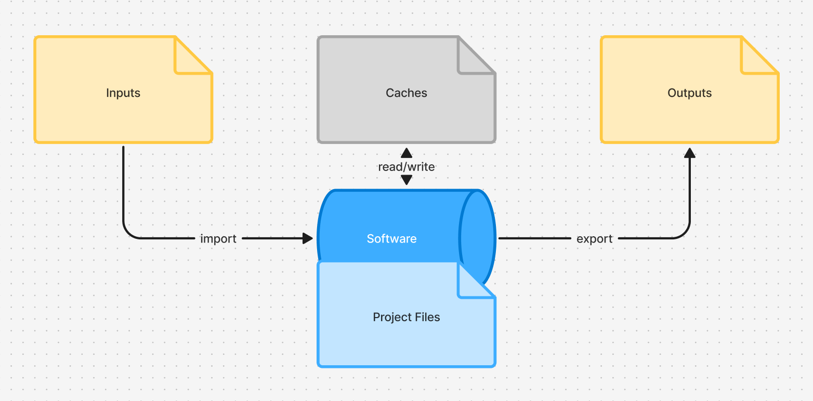

# Why Omoospace?

For any digital work with slight complexity, you’ll often handle more than one file. When files pile up, you’ll try to sort them with folders. A proper folder structure helps teams locate files quickly and lets you revisit old projects easily. So how to design a reasonable folder structure? 


## Key Points for a Good Design

### Workflows in Common

All creative work, whether modeling, animation, or AI pipelines, can be abstracted into a unified structure if files are stored on a hard drive:



Everything in the workflow falls into 4 categories:

- Project files: Software-specific format files

- Inputs: Imported files like images, audios, videos, and models...

- Outputs: Exported results (may be imported in next-step)

- Staged data: Deletable/regenerable files (caches, backups)

This provides a basis for rational file classification, enabling a universal folder structure for all workflows in theory.

### Laziness Is Acceptable

Few people stick to maintaining complex project folders, let alone artists😂. Thus, minimizing operational effort to keep projects structured is crucial. The goal of a folder structure is easy maintenance, so clarity is paramount.

Time-saving tips:

- Use filenames as annotations. Avoid ambiguous abbreviations/codes—you won’t want to be confused when reopening source files months later. Clear filenames eliminate the need for extra documentation. (An AI-powered auto-naming tool is feasible now)

- Use prefixes to imply connections. For example, two source files prefixed with `Seq010_` are obviously related to `Seq010`. Similarly, `Seq010_Props.blend` and `.glb` models prefixed with `Seq010_Props_` clearly show the export relationship.

- Auto-sort resources. Standardize export paths (e.g., renders to Renders, videos to Videos). Sort imported assets by file format.

- Don’t manage all files. Staged data is mostly handled in software—paths can be messy as long as filenames don’t conflict. Downloaded resources or files from other projects have random structures; sorting them by type wastes time and isn’t necessary.

### Project Document

Software updates rapidly—multiple versions may release during a project cycle. Archived projects may require older software versions to open. You need a place to record software versions used, plus plugins, team members, their roles, and project descriptions.


## Shortcomings of Other Solutions

### ⚠️ Incompatible Software-native Systems

Most software with external resource imports has built-in asset management features: "Collect Files" in After Effects, "Pack Resources" in Blender, "Save Project with Assets" in Cinema 4D, "Set a Project" in Maya, $JOB in Houdini, and so on.

These features are useful but use inconsistent folder structures. This breaks cross-software collaboration unless you use one tool end-to-end. Conclusion: Software-native solutions are not optimal—we need a unified folder structure compatible with all tools.

### ⚠️ No Isolation Between Resource Assets and Project Files

What happens when they’re mixed? Example:

```bash
Project001
|-- Assets
|   |-- PropA
|   |   |-- PropA.blend # referenced file
|   |   `-- PropA_wip.blend # wip file
```

Both are Blender files, but PropA.blend is a static resource, while PropA_wip.blend is a dynamic working file. Putting them together seems logical but overlooks project growth:

As projects expand, you may split files into folders (e.g., move PropA to Seq010). This breaks references to PropA.blend. Moving only PropA_wip.blend creates duplicate folders.

Thus, isolate static resource assets and dynamic source files. Mixing them causes conflicts: rigid structures if prioritizing stability, or broken references if prioritizing flexibility. The issue worsens in team collaboration.


## Omoospace Principles

No single software covers all creative workflows, and processes evolve with technology. Hence Omoospace was born—to guide creative file storage. It’s a set of principles, not rigid rules or a management tool.